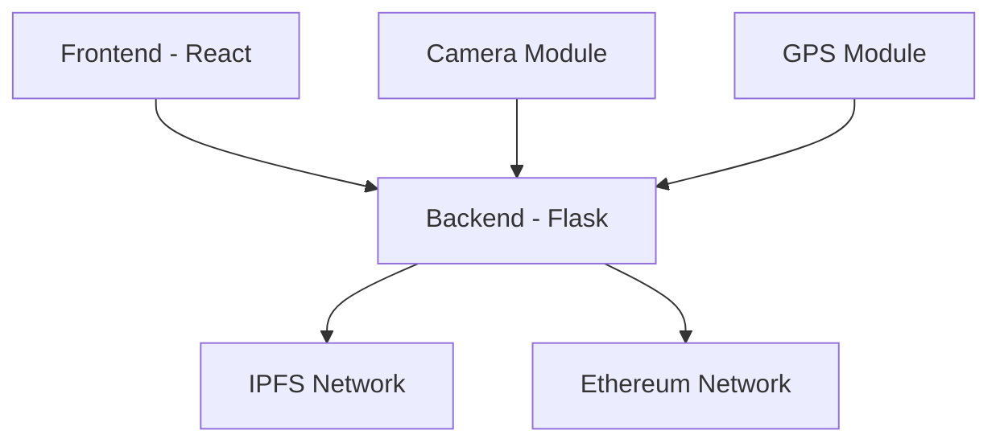

# 📸 BlockSnap

<div align="center">


[](https://opensource.org/licenses/MIT)
[](https://www.python.org/downloads/)
[](https://docs.soliditylang.org/)
[](https://reactjs.org/)

*A decentralized camera system for verifiable and authentic digital photography*

[Features](#features) •
[Installation](#installation) •
[Documentation](#documentation) •
[Contributing](#contributing)

</div>

---

## 📋 Table of Contents

- [Overview](#overview)
- [Key Features](#key-features)
- [System Architecture](#system-architecture)
- [Getting Started](#getting-started)
  - [Prerequisites](#prerequisites)
  - [Installation](#installation)
  - [Configuration](#configuration)
- [Usage Guide](#usage-guide)
- [Technical Documentation](#technical-documentation)
- [Development](#development)
- [Troubleshooting](#troubleshooting)
- [Contributing](#contributing)
- [License](#license)

## 🎯 Overview

BlockSnap revolutionizes digital photography by combining blockchain technology with image capture to create verifiable and tamper-proof photographs. Each image captured through BlockSnap is:

1. Captured securely through hardware integration
2. Stored permanently on IPFS (InterPlanetary File System)
3. Minted as an NFT on the Ethereum blockchain
4. Verifiable for authenticity and ownership

### Why BlockSnap?

In an era of deepfakes and digital manipulation, BlockSnap provides:

- **Authenticity**: Cryptographic proof of original images
- **Ownership**: Clear digital rights management through NFTs
- **Immutability**: Tamper-proof storage on blockchain
- **Transparency**: Public verification system

### Use Cases

- 📰 **Photojournalism**: Verify news photo authenticity
- ⚖️ **Legal Documentation**: Tamper-proof evidence
- 🎨 **Art Authentication**: Prove digital art originality
- 📸 **Professional Photography**: Protect image rights
- 🏛️ **Historical Documentation**: Preserve authentic records

## ✨ Key Features

### Core Capabilities

- **Secure Image Capture**
  - Direct hardware integration with Raspberry Pi Camera
  - GPS location tagging (optional)
  - Timestamp verification
  - Resolution control

- **Decentralized Storage**
  - IPFS integration for permanent storage
  - Content-addressed data
  - Optional Pinata pinning service
  - Redundant storage

- **Blockchain Integration**
  - ERC-721 NFT standard
  - Metadata storage
  - Ownership tracking
  - Public verification

- **Web3 Features**
  - MetaMask wallet integration
  - Gas optimization
  - Network configuration
  - Transaction management

### Technical Features

- **Frontend**
  - Real-time camera preview
  - Gallery view
  - Verification interface
  - Responsive design
  - Dark/Light themes

- **Backend**
  - RESTful API
  - IPFS node management
  - Blockchain interaction
  - Error handling
  - Logging system

## 🏗️ System Architecture

### Component Overview



### Directory Structure

```
BlockSnap/
├── backend/
│   ├── app.py                 # Flask application
│   ├── blockchain_handler.py  # Ethereum interactions
│   ├── ipfs_handler.py        # IPFS operations
│   ├── camera_handler.py      # Hardware control
│   └── utils/                 # Helper functions
├── frontend/
│   ├── src/
│   │   ├── components/        # React components
│   │   ├── pages/            # Application pages
│   │   ├── hooks/            # Custom React hooks
│   │   ├── context/          # React context
│   │   └── utils/            # Helper functions
│   └── public/               # Static assets
├── smart_contracts/
│   ├── BlockSnapNFT.sol      # Main NFT contract
│   └── test/                 # Contract tests
├── hardware/
│   ├── camera.py             # Camera implementation
│   └── gps.py               # GPS implementation
└── scripts/
    ├── deploy.js             # Contract deployment
    └── verify.js             # Contract verification
```

## 🚀 Getting Started

### Prerequisites

#### Hardware Requirements

- **Raspberry Pi**
  - Model 4B (2GB+ RAM) or 3B+
  - MicroSD card (16GB+)
  - Power supply (3A)

- **Camera Module**
  - Raspberry Pi Camera Module v2
  - or compatible camera

- **Optional Hardware**
  - GPS Module (for location tagging)
  - Touchscreen display
  - GPIO buttons

#### Software Requirements

- **Operating System**
  - Raspberry Pi OS (64-bit)
  - or Ubuntu 22.04+

- **Development Tools**
  - Python 3.11+
  - Node.js 16+
  - npm/yarn
  - Git

- **Blockchain Tools**
  - MetaMask
  - Hardhat
  - IPFS

### Installation

1. **System Setup**
   ```bash
   # Update system
   sudo apt update && sudo apt upgrade -y

   # Install dependencies
   sudo apt install -y python3-pip nodejs npm git
   ```

2. **IPFS Setup**
   ```bash
   # Download and install IPFS
   wget https://dist.ipfs.io/go-ipfs/v0.12.0/go-ipfs_v0.12.0_linux-amd64.tar.gz
   tar -xvzf go-ipfs_v0.12.0_linux-amd64.tar.gz
   cd go-ipfs
   sudo bash install.sh
   ipfs init
   ```

3. **Project Setup**
   ```bash
   # Clone repository
   git clone https://github.com/yourusername/BlockSnap.git
   cd BlockSnap

   # Setup Python environment
   python -m venv venv
   source venv/bin/activate
   pip install -r requirements.txt

   # Setup frontend
   cd frontend
   npm install
   ```

### Configuration

1. **Environment Setup**
   Create `.env` file:
   ```env
   # Ethereum Configuration
   ETH_RPC_URL=https://sepolia.infura.io/v3/YOUR_KEY
   CONTRACT_ADDRESS=YOUR_CONTRACT_ADDRESS
   PRIVATE_KEY=YOUR_PRIVATE_KEY

   # IPFS Configuration
   IPFS_HOST=/ip4/127.0.0.1/tcp/5001
   IPFS_GATEWAY=https://ipfs.io
   USE_PINATA=false
   PINATA_API_KEY=your_key
   PINATA_SECRET_KEY=your_secret

   # Hardware Configuration
   CAMERA_RESOLUTION=1920x1080
   SHUTTER_PIN=17
   LED_PIN=27
   USE_GPS=false
   GPS_PORT=/dev/ttyUSB0
   ```

2. **Smart Contract Deployment**
   ```bash
   # Deploy contract
   npx hardhat run scripts/deploy.js --network sepolia

   # Verify contract
   npx hardhat verify --network sepolia DEPLOYED_ADDRESS
   ```

## 📱 Usage Guide

### Complete Workflow

1. **Initial Setup**
   - Install BlockSnap
   - Configure environment
   - Deploy smart contract
   - Start services

2. **Taking Photos**
   ```mermaid
   sequenceDiagram
       participant User
       participant Camera
       participant IPFS
       participant Blockchain
       
       User->>Camera: Capture Photo
       Camera->>IPFS: Upload Photo
       IPFS-->>Camera: Return CID
       Camera->>Blockchain: Mint NFT
       Blockchain-->>User: Confirm Transaction
   ```

3. **Viewing Gallery**
   - Connect wallet
   - Browse captured photos
   - View metadata
   - Download originals

4. **Verifying Photos**
   - Input IPFS CID
   - Check blockchain record
   - View ownership history
   - Verify metadata

## 📚 Technical Documentation

### API Reference

#### POST /api/capture
Capture and mint new photo
```json
Request:
{
    "wallet_address": "0x...",
    "image_data": "base64_string"
}

Response:
{
    "status": "success",
    "data": {
        "token_id": "1",
        "ipfs_cid": "Qm...",
        "tx_hash": "0x..."
    }
}
```

#### GET /api/verify/{cid}
Verify photo authenticity
```json
Response:
{
    "verified": true,
    "owner": "0x...",
    "timestamp": "2024-12-26T10:00:00Z",
    "metadata": {
        "location": "...",
        "device": "..."
    }
}
```

### Smart Contract

#### BlockSnapNFT
```solidity
function mintPhoto(
    address to,
    string memory imageCID,
    string memory metadataURI
) public returns (uint256)

function verifyPhoto(
    string memory imageCID
) public view returns (bool, address)
```

## 🛠️ Development

### Running Services

1. **Start IPFS**
   ```bash
   ipfs daemon
   ```

2. **Start Backend**
   ```bash
   source venv/bin/activate
   python main.py
   ```

3. **Start Frontend**
   ```bash
   cd frontend
   npm start
   ```

### Testing

```bash
# Smart Contract Tests
npx hardhat test

# Backend Tests
pytest

# Frontend Tests
npm test
```

## 🔧 Troubleshooting

### Common Issues

1. **IPFS Connection**
   - Check daemon status
   - Verify port accessibility
   - Check network connectivity

2. **Blockchain Issues**
   - Verify network selection
   - Check gas prices
   - Confirm wallet connection

3. **Camera Problems**
   - Enable camera interface
   - Check permissions
   - Verify hardware connection

## 🤝 Contributing

We welcome contributions! Please see our [Contributing Guide](CONTRIBUTING.md) for details.

### Development Process

1. Fork repository
2. Create feature branch
3. Commit changes
4. Push to branch
5. Submit pull request

### Code Standards

- Python: Follow PEP 8
- JavaScript: ESLint config
- Solidity: Solidity style guide
- Documentation: JSDoc/docstrings

## 📄 License

MIT License - See [LICENSE](LICENSE) file for details

---

<div align="center">
Made with ❤️ by the BlockSnap Team
</div>
